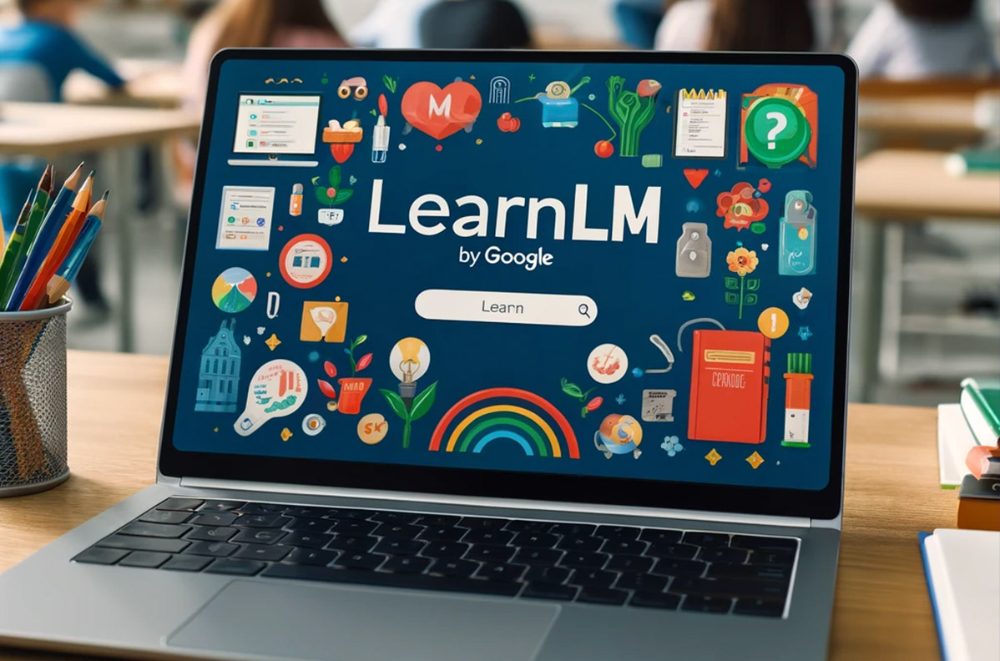
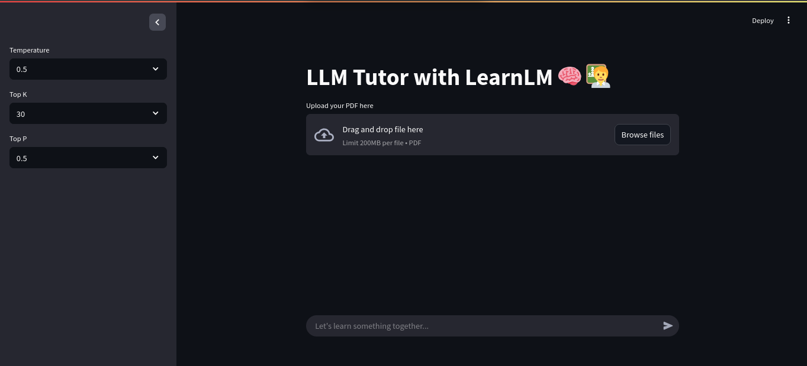
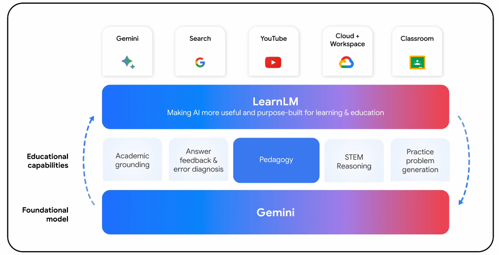

# Review your studies with LearnLM (English)

## Project Description

This project implements a conversational chatbot capable of interacting with the content of PDF files uploaded by the user. Using Google's experimental LearnLM model in conjunction with the Retrieval Augmented Generation (RAG) technique and a Vector Store, the chatbot not only answers questions about the document, but has also been adjusted to challenge the user with pertinent questions, promoting technical deepening and guiding the user until they reach their own conclusions.

The workflow is simple: the user uploads a PDF file through the web interface, the PDF content is processed and stored in a vector index, and then the user can start a conversation with the chatbot about the uploaded material. It also has a sidebar for easily parameterizing LearnLM.

## Technologies Used

* **Python 3.11**
* **LangChain**
* **Streamlit**
* **FAISS**
* **PyPDF2**

## Features

* Upload PDF files via web interface.
* Adjust parameters such as: temperature, top_k, top_p.
* Process PDF content to create a vector index.
* Interactive conversation with the chatbot about the PDF content.
* Chatbot that challenges and guides the user through questions.

## How to Use

1. When you open the application, you will see an option to upload a PDF file.
2. Click to upload your PDF file.
3. Wait while the PDF content is processed and the vector index is created.
4. Once the processing is complete, a chat area will be displayed.
5. Start typing your questions about the PDF content and interact with the chatbot.

Explore the questions it generates to deepen your understanding!

# About LearnLM

**LearnLM – Google's Educational AI**

**LearnLM** is a family of artificial intelligence models created by Google with an exclusive focus on **education**, based on the **Gemini** models and adjusted with principles of **learning science**. Its main purpose is to transform the teaching-learning process, making it **more active, personalized and motivating**.

### Main features:

* **Student adaptation**: The model adjusts its behavior according to the learner's goals, style and individual progress.
* **Stimulating curiosity**: Seeks to keep the student engaged and interested throughout the process.
* **Promoting metacognition**: Helps the student reflect on their own learning, identify difficulties and plan their next steps.
* **Active learning**: Encourages problem-solving and practice with feedback, instead of just providing ready-made answers.
* **Cognitive load management**: Presents information in a structured and relevant way to avoid mental overload.

### Why was LearnLM created?

The motivation arose from the realization that traditional language models are great at presenting information, but not necessarily at teaching. **Google wanted to create a model with a pedagogical function**, acting as a **tutor or learning assistant**, that would guide the student on their journey, helping not only with answers, but with **exploration, questioning and reflection**.

### Who is behind the project?

LearnLM is the result of a joint effort within Google, involving:

* **Google DeepMind**, with expertise in advanced AI.

* **Google Research**, focused on applying AI in different domains.

* **Google Product Teams**, responsible for bringing this technology to end users.

### Where is it being used?

Since its announcement at **Google I/O 2024**, LearnLM has been gradually integrated into widely used products:

* **Google Search**: Generates personalized educational summaries with AI.

* **YouTube**: Allows interactions with educational videos, such as answering questions and taking quizzes.

* **Google Classroom**: Supports teachers in personalizing content and planning lessons.

* **Gemini Apps**: Enables the creation of personalized assistants (“Gems”) focused on specific topics.

In short, **LearnLM represents an important step for Google in using AI to support education**, offering not only information, but also **intelligent, adaptive and pedagogical support** throughout the learning process.

---

# Revise seus estudos com LearnLM (PT-BR)

## Descrição do Projeto

Este projeto implementa um chatbot conversacional capaz de interagir com o conteúdo de arquivos PDF carregados pelo usuário. Utilizando o modelo experimental LearnLM do Google em conjunto com a técnica de Retrieval Augmented Generation (RAG) e um Vector Store, o chatbot não apenas responde a perguntas sobre o documento, mas também foi ajustado para desafiar o usuário com questionamentos pertinentes, promovendo um aprofundamento técnico e guiando o usuário até a chegada de conclusões próprias.

O fluxo de trabalho é simples: o usuário carrega um arquivo PDF através da interface web, o conteúdo do PDF é processado e armazenado em um índice de vetores, e então o usuário pode iniciar uma conversa com o chatbot sobre o material carregado. Também conta com uma barra lateral para parametrizar de forma simples o LearnLM. 

## Tecnologias Utilizadas

* **Python 3.11**
* **LangChain**
* **Streamlit**
* **FAISS**
* **PyPDF2**

## Funcionalidades

* Carregamento de arquivos PDF via interface web.
* Ajuste de parâmetros como: temperature, top_k, top_p.
* Processamento do conteúdo do PDF para criação de um índice de vetores.
* Conversação interativa com o chatbot sobre o conteúdo do PDF.
* Chatbot que desafia e guia o usuário através de questionamentos.

## Como Usar

1.  Ao abrir a aplicação, você verá uma opção para carregar um arquivo PDF.
2.  Clique para carregar o seu arquivo PDF.
3.  Aguarde enquanto o conteúdo do PDF é processado e o índice de vetores é criado.
4.  Uma vez que o processamento estiver completo, uma área de chat será exibida.
5.  Comece a digitar suas perguntas sobre o conteúdo do PDF e interaja com o chatbot.

Explore os questionamentos que ele gerar para aprofundar seu entendimento!

# Sobre o LearnLM

**LearnLM – IA Educacional do Google**

O **LearnLM** é uma família de modelos de inteligência artificial criada pelo Google com foco exclusivo em **educação**, baseada nos modelos **Gemini** e ajustada com princípios da **ciência da aprendizagem**. Seu propósito principal é transformar o processo de ensino-aprendizagem, tornando-o **mais ativo, personalizado e motivador**.

### Características principais:

* **Adaptação ao estudante**: O modelo ajusta seu comportamento de acordo com os objetivos, estilo e progresso individual do aprendiz.
* **Estímulo à curiosidade**: Busca manter o aluno engajado e interessado ao longo do processo.
* **Promoção da metacognição**: Ajuda o aluno a refletir sobre seu próprio aprendizado, identificar dificuldades e planejar seus próximos passos.
* **Aprendizagem ativa**: Incentiva a resolução de problemas e prática com feedback, em vez de apenas fornecer respostas prontas.
* **Gerenciamento da carga cognitiva**: Apresenta informações de forma estruturada e relevante para evitar sobrecarga mental.

### Por que o LearnLM foi criado?

A motivação surgiu da constatação de que os modelos de linguagem tradicionais são ótimos em apresentar informações, mas não necessariamente em ensinar. O **Google quis criar um modelo com função pedagógica**, atuando como um **tutor ou assistente de aprendizagem**, que guiasse o aluno em sua jornada, ajudando não apenas com respostas, mas com **exploração, questionamento e reflexão**.

### Quem está por trás do projeto?

O LearnLM é resultado de um esforço conjunto dentro do Google, envolvendo:

* **Google DeepMind**, com expertise em IA avançada.
* **Google Research**, com foco em aplicar IA em diferentes domínios.
* **Equipes de Produto do Google**, responsáveis por levar essa tecnologia aos usuários finais.

### Onde está sendo usado?

Desde seu anúncio no **Google I/O 2024**, o LearnLM vem sendo integrado gradualmente a produtos amplamente utilizados:

* **Pesquisa Google**: Geração de resumos didáticos e personalizados com IA.
* **YouTube**: Permite interações com vídeos educacionais, como tirar dúvidas e responder quizzes.
* **Google Classroom**: Apoia professores na personalização de conteúdos e no planejamento de aulas.
* **Gemini Apps**: Possibilita a criação de assistentes personalizados (“Gems”) voltados para tópicos específicos.

Em suma, o **LearnLM representa um passo importante do Google no uso da IA para apoiar a educação**, oferecendo não só informações, mas **acompanhamento inteligente, adaptativo e pedagógico** ao longo do processo de aprendizagem.
